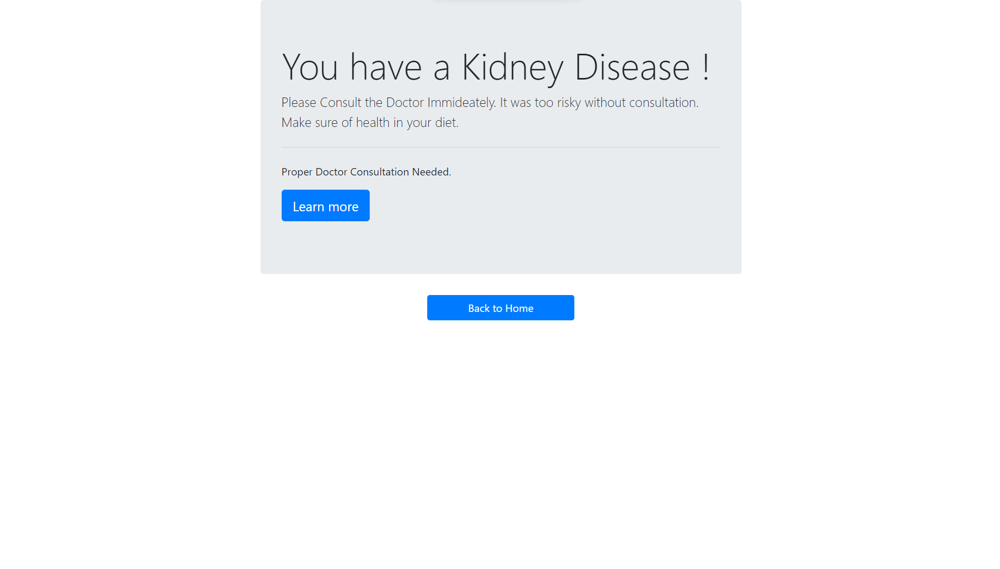

# Chronic Kidney Disease Prediction Using ML & Flask 

A Web Based Kidney Disease prediction app implemented on Random Forest Algorithm and deployed on Flask.

## *Home:*

## *Result:*

 

Hala Sedki
MLOPs Course 2024
